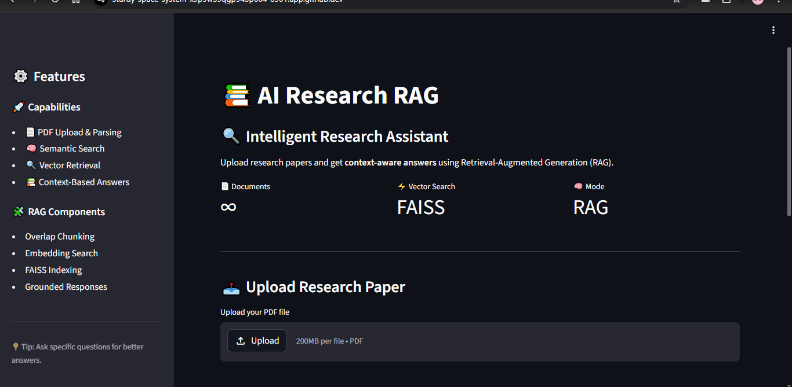
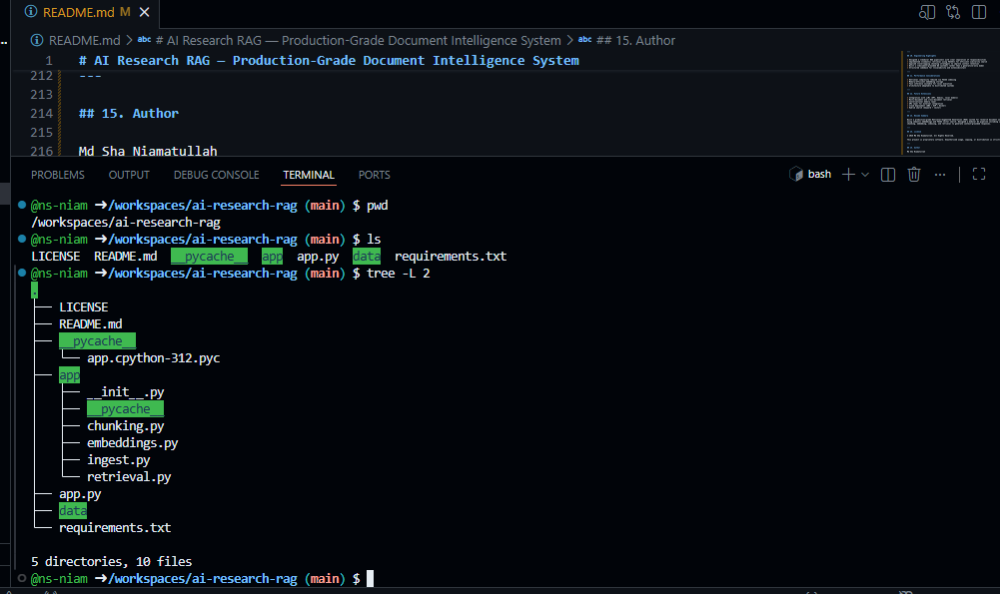
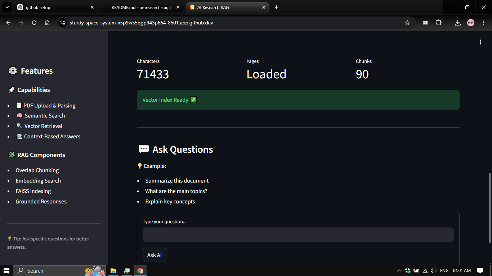

# AI Research RAG — Production-Grade Document Intelligence System

<div align="center">

### Retrieval-Augmented Generation (RAG) for Research Paper Understanding

A modular AI system that enables **semantic search, contextual retrieval, and grounded response generation** over research documents.

<br>


</div>

---
## 🎥 Demo Video

A complete walkthrough of the AI Research RAG system including:

- PDF ingestion
- semantic retrieval
- contextual querying
- Streamlit interface
- end-to-end RAG workflow

### ▶ Watch Demo

[](https://github.com/user-attachments/assets/4cdcf3d9-d588-44c0-800f-e668f036f326)


## 1. Problem Statement

Traditional language models generate answers without direct access to source documents, leading to **hallucinations and unverifiable outputs**.

This project addresses that limitation by implementing a **Retrieval-Augmented Generation (RAG)** pipeline that ensures responses are:

- grounded in source data
- traceable to document context
- more reliable for research use

---

## 2. System Overview

The system transforms static PDFs into a **queryable semantic knowledge base**.

Core capabilities:

- ingest and process research papers
- convert text into dense vector representations
- perform similarity-based retrieval
- generate answers conditioned on retrieved context

---

## 3. Architecture

```text
User Query
   ↓
Retriever (FAISS Index)
   ↓
Top-K Relevant Chunks
   ↓
Context Assembly
   ↓
Generator (Context-Aware Response)

### Extended Pipeline

```text
PDF → Extraction → Cleaning → Chunking → Embeddings → Indexing → Retrieval → Generation
```

---

## 4. Retrieval Pipeline Design

### 4.1 Document Ingestion

* PDF parsing using PyPDF
* text normalization and cleaning
* removal of noise and formatting artifacts

### 4.2 Chunking Strategy

* fixed-size chunking with overlap
* preserves semantic continuity across boundaries
* improves retrieval recall

### 4.3 Embedding Layer

* transformer-based sentence embeddings
* dense vector representation of text chunks
* optimized for semantic similarity

### 4.4 Vector Indexing

* FAISS for efficient nearest neighbor search
* sub-linear retrieval performance
* scalable to large document collections

### 4.5 Retrieval

* Top-K similarity search
* cosine similarity-based ranking
* context filtering before generation

---

## 5. Generation Strategy

Instead of generating responses directly, the system:

1. retrieves relevant document segments
2. injects them into the prompt/context
3. generates an answer constrained by retrieved knowledge

This significantly reduces hallucination and improves factual alignment.

---

## 6. Tech Stack

| Layer           | Technology            |
| --------------- | --------------------- |
| Language        | Python                |
| Interface       | Streamlit             |
| Embeddings      | Sentence Transformers |
| Vector Database | FAISS                 |
| Data Processing | NumPy                 |
| PDF Parsing     | PyPDF                 |

---

## 7. Project Structure

```text
ai-research-rag/
├── app.py
├── requirements.txt
├── README.md
├── LICENSE
├── demo/
│   └── rag-demo.mp4
├── screenshots/
│   ├── tree.png
│   ├── ui-home.png
│   └── query-result.png
└── app/
    ├── ingest.py
    ├── chunking.py
    ├── embeddings.py
    └── retrieval.py
```

---

## 8. Demo Video

[Watch the full demo video](https://github.com/user-attachments/assets/4cdcf3d9-d588-44c0-800f-e668f036f326)

---

## 9. Screenshots

### Project Structure



### UI Home


### Query Result



---

## 10. Example Queries

* Summarize the paper
* What are the main contributions?
* Describe the methodology
* What problem does this work address?
* Extract key insights

---

## 11. Execution

```bash
git clone https://github.com/ns-niam/AI-Research-RAG.git
cd ai-research-rag

pip install -r requirements.txt
streamlit run app.py
```

---

## 12. Engineering Highlights

* Designed a **modular RAG pipeline** with clear separation of responsibilities
* Implemented **semantic retrieval using FAISS** for efficient similarity search
* Applied **overlapping chunking strategy** to improve context retention
* Built a **document-grounded QA system** rather than a generative-only model
* Structured codebase for **scalability and extensibility**

---

## 13. Performance Considerations

* Retrieval complexity reduced via FAISS indexing
* Memory-efficient embedding storage
* Fast inference suitable for local execution
* Architecture adaptable to distributed systems

---

## 14. Future Extensions

* Integration with LLMs (GPT, Gemini, local models)
* Multi-document and cross-document retrieval
* Conversational memory layer
* API layer for external integration
* Cloud deployment (AWS / GCP / Docker)
* Hybrid search (keyword + vector)

---

## 15. Resume Summary

Built a production-grade Retrieval-Augmented Generation (RAG) system for research document understanding using semantic embeddings and FAISS vector search. Designed a modular AI pipeline including ingestion, chunking, embedding, indexing, and retrieval to generate context-grounded responses.

---

## 16. License

© 2026 Md Sha Niamatullah. All Rights Reserved.

This project is proprietary software. Unauthorized usage, copying or distribution is strictly prohibited.

---

## 17. Author

Md Sha Niamatullah

AI / ML Engineering Student

---

## 18. Status

Stable, functional, and ready for demonstration.

````
